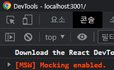

# MSW CRUD Test

# # 프로젝트 생성


**`$ npx create-react-app msw`**

# # MSW 라이브러리 설치


**`$ npm i -D msw`**

# # 서비스 워커 코드 생성


**`$ npx msw init public/ --save`**

- 현재 디렉토리에서 **`‘public/’`** 디렉토리를 만들고, MSW의 초기 설정 파일을 그 안에 생성
- **`--save`**플래그를 사용하면, 이 설정 파일을 **`package.json`** 파일의 **`dependencies`**에 자동으로 추가

# # 요청 핸들러


- REST API를 모킹할 때 `msw` 모듈의 `rest`객체를 사용.
- 할일 목록을 **조회**하가 위한 `GET /todos` 앤드포인트는 배열에 담긴 3개의 할일을 **응답**
- 새로운 할일을 **추가**하기 위한 `POST /todos` 앤드포인트는 요청 바디로 넘어온 할일을 배열에 **추가**
- 할일을 **수정**하기 위한 `Put /todos` 앤드포인트는 요청 바디로 넘어온 할일을 배열에서 **수정**
- 할일을 **삭제**하기 위한 `Delete /todos` 앤드포인트는 요청 바디로 넘어온 할일을 배열에 **삭제**

```jsx
// /src/mocks/handlers.js

import { rest } from "msw";

let todos = [
  { id: 1, text: "집에" },
  { id: 2, text: "가고" },
  { id: 3, text: "싶다" }
];

export const handlers = [
  // 할일 목록
  rest.get("/todos", (req, res, ctx) => {
    return res(ctx.status(200), ctx.json(todos));
  }),

  // 할일 추가
  rest.post("/todos", (req, res, ctx) => {
    const newTodo = {
      id: todos.length + 1,
      text: req.body
    };
    todos.push(newTodo);
    return res(ctx.status(201));
  }),

  // 할일 수정
  rest.put("/todos/:id", (req, res, ctx) => {
    const todoId = parseInt(req.params.id);
    const updatedTodo = {
      id: todoId,
      text: req.body
    };
    const index = todos.findIndex((todo) => todo.id === todoId);
    todos[index] = updatedTodo;
    return res(ctx.status(200));
  }),

  // 할일 삭제
  rest.delete("/todos/:id", (req, res, ctx) => {
    const todoId = parseInt(req.params.id);
    todos = todos.filter((todo) => todo.id !== todoId);
    return res(ctx.status(200));
  })
];
```

# # 서비스 워커 생성


- `msw`모듈에서 제공하는 `setupWorker()` 함수를 사용해서 서비스 워커를 생성하기.
- 위에서 작성한 요청 핸들러 코드를 불러와서  `setupWorker()` 함수의 인자로 넘기기

```jsx
**// /src/mocks/worker.js
import { setupWorker } from "msw";
import { handlers } from "./handlers";

export const worker = setupWorker(...handlers);**
```

# # 서비스 워커 삽입


```jsx
// src/index.js

import { StrictMode } from "react";
import { createRoot } from "react-dom/client";

import App from "./App";
**import { worker } from "./mocks/worker";
if (process.env.NODE_ENV === "development") {
  worker.start();
}**

const rootElement = document.getElementById("root");
const root = createRoot(rootElement);

root.render(
  <StrictMode>
    <App />
  </StrictMode>
);
```

# # 서비스 워커 테스트


- 애플리케이션 구동 후 브라우저에서 열면 콘솔에 다음과 같이 **모킹 활성화되었다**는 메시지 출력



# # UI


```jsx
import { useEffect, useState } from "react";

function App() {
  const [todos, setTodos] = useState([]);
  const [todo, setTodo] = useState("");
  const [loading, setLoading] = useState(false);
  const [editingTodoId, setEditingTodoId] = useState(null);
  const [editingTodoText, setEditingTodoText] = useState('');

  useEffect(() => {
    setLoading(true);
    fetch("/todos")
      .then((res) => res.json())
      .then((data) => {
        setTodos(data);
        setLoading(false);
      });
  }, []);  

  // POST
  const handleSubmit = (event) => {
    event.preventDefault();
    setLoading(true);
    fetch("/todos", {
      method: "POST",
      headers: {
        "Content-Type": "application/json"
      },
      body: JSON.stringify(todo)
    }).then(() => {
      setTodo("");
      setLoading(false);
      fetch("/todos")
        .then((res) => res.json())
        .then((data) => {
          setTodos(data);
        });
    });
  };

  // 
  const handleEdit = (todoId, todoText) => {
    setEditingTodoId(todoId);
    setEditingTodoText(todoText);
  };

  // Put
  const handleUpdate = (event, todoId) => {
    event.preventDefault();
    setLoading(true);
    fetch(`todos/${todoId}`, {
      method: "PUT",
      headers: {
        "Content-Type": "application/json"
      },
      body: editingTodoText
    }).then((res) => {
      fetch("/todos")
        .then((res) => res.json())
        .then((data) => {
          setEditingTodoId(null);
          setEditingTodoText("");
          setTodos(data);
          setLoading(false);
        });
    });
  };

  // Delete
  const handleDelete = (todoId) => {
    setLoading(true);
    fetch(`/todos/${todoId}`, {
      method: "DELETE"
    }).then(() => {
      setLoading(false);
      fetch("/todos")
        .then((res) => res.json())
        .then((data) => {
          setTodos(data);
        });
    });
  };

  return (
    <div>
      <h2>할일 목록</h2>

      <ul>
        {todos.map((todo, index) => (
          <li key={todo.id}>
            {editingTodoId === todo.id ? (
              <form onSubmit={(event) => handleUpdate(event, todo.id)}>
                <input
                  type="text"
                  name="todo"
                  value={editingTodoText}
                  onChange={({ target: { value } }) => setEditingTodoText(value)}
                  disabled={loading}
                />
                <button disabled={!editingTodoText}>저장</button>
                <button type="button" onClick={() => setEditingTodoId(null)}>
                  취소
                </button>
              </form>
            ) : (
              <>
                {todo.text}
                <button type="button" onClick={() => handleEdit(todo.id, todo.text)}>
                  수정
                </button>
                <button type="button" onClick={() => handleDelete(todo.id)}>
                  삭제
                </button>
              </>
            )}
          </li>
        ))}
      </ul>

      <form onSubmit={handleSubmit}>
        <input
          type="text"
          name="todo"
          placeholder="새로운 할일"
          disabled={loading}
          value={todo}
          onChange={({ target: { value } }) => setTodo(value)}
        />
        <button disabled={!todo}>추가</button>
      </form>
    </div>
  );
}

export default App;
```